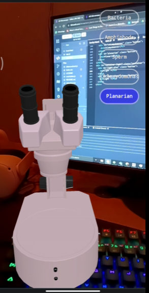
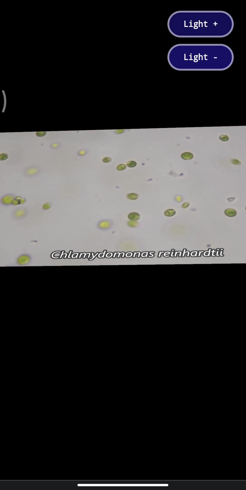
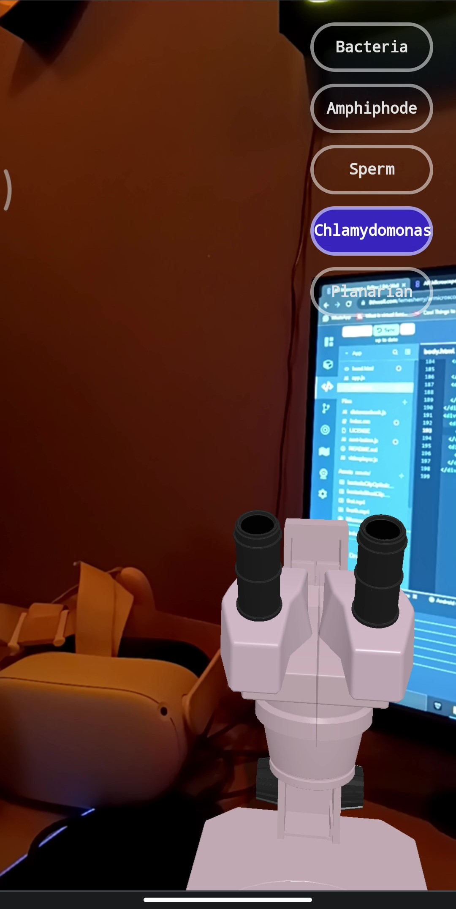
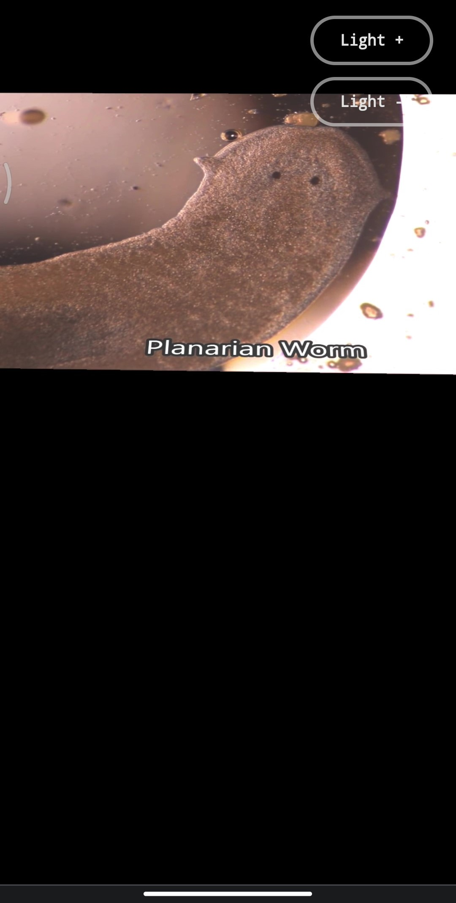

# Microscope AR Experience

Discover a new dimension of learning with our Microscope AR experience. Explore the microscopic world in augmented reality, offering an interactive and educational journey right from your device.

## About Microscope AR

Embark on an educational adventure with Microscope AR. This augmented reality app transforms your device into a virtual microscope, allowing you to view and interact with various types of bacteria and viruses. Adjust settings like focus and light intensity to observe microscopic entities in great detail.

## Experience Details

### Features
- Interactive AR microscope experience on your device.
- Explore different bacteria and viruses with detailed visuals.
- Customizable settings including focus and light adjustments.
- Learn about various microorganisms through interactive annotations.
- Blends virtual objects with the real world for an immersive experience.
- Great tool for education, blending learning with technology.

### How It Works
- Download the Microscope AR app on your device.
- Launch the app and use your device's camera to start the experience.
- Choose the type of microorganism you wish to explore.
- Use intuitive controls to adjust focus, blur, and lighting.
- Interactive annotations offer insights into various microorganisms.

### Key Benefits
- Enhances learning through augmented reality.
- A convenient and interactive way to study microbiology.
- Safe and educational exploration of the microscopic world.
- A modern tool for educational institutions and enthusiasts.

## Gallery

## Links

- [Experience Details](https://yourwebsite.com/microscope-ar)
- [Visit Our Website](https://yourwebsite.com)

---

© Your Company Name. All rights reserved.
